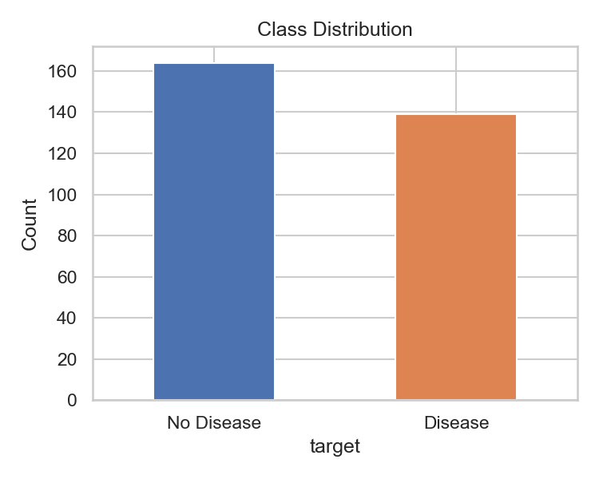
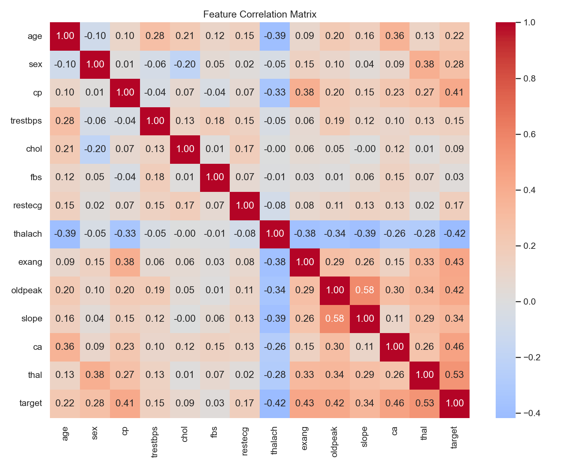
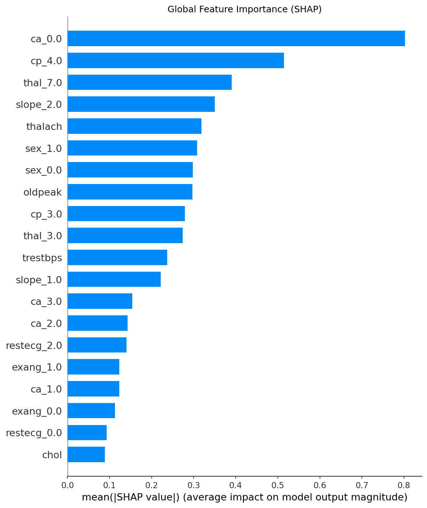
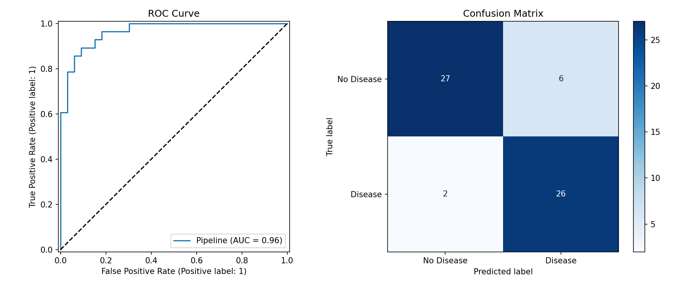

# 🫀 Heart Disease Predictor

A production-ready machine learning web application that predicts heart disease risk from clinical patient data, with per-prediction explainability via SHAP values.

**Live API:** https://jakariasami-heart-disease-predictor.hf.space/docs


---

## Overview

This project demonstrates a full end-to-end ML pipeline, from raw data to a deployed, explainable REST API. Built on the UCI Heart Disease dataset (303 patients, 13 clinical features).

The goal was not just to train a model, but to build something production-ready: clean preprocessing pipelines, rigorous evaluation, containerized deployment, and a CI/CD workflow that runs tests on every push.

---

## EDA Highlights
| | |
|---|---|
|  |  |
|  |  |

- Target is reasonably balanced (54% positive) — SMOTE applied as a precaution
- `cp` (chest pain type) and `thalach` (max heart rate) are the strongest predictors
- `ca` and `thal` had missing values disguised as zeros — treated as NaN using domain knowledge
- `oldpeak` is right-skewed — handled via the preprocessing pipeline

---

## Results

| Model | Accuracy | F1 | ROC-AUC |
|---|---|---|---|
| Logistic Regression ✅ | 0.868 | 0.866 | 0.964 |
| Random Forest | 0.901 | 0.900 | 0.937 |
| Gradient Boosting | 0.901 | 0.896 | 0.926 |
| XGBoost | 0.885 | 0.881 | 0.906 |

**5-Fold CV ROC-AUC: 0.917 ± 0.026** — confirms the score is robust and not a result of a favorable train/test split.

Logistic Regression was selected as the final model. The simplest model won, which is the preferred outcome in production ML (interpretable, fast, maintainable).

---

## Architecture

    UCI Dataset → Preprocessing Pipeline → Model Training → FastAPI Backend
                                                                    ↓
                                                            Streamlit Frontend
                                                                    ↓
                                                            SHAP Explainability


**Stack:**
- **Data & Modeling:** pandas, scikit-learn, XGBoost, imbalanced-learn (SMOTE)
- **Explainability:** SHAP (LinearExplainer with real training data background)
- **Experiment Tracking:** MLflow
- **API:** FastAPI + Pydantic
- **Frontend:** Streamlit
- **Deployment:** Docker → Hugging Face Spaces
- **CI/CD:** GitHub Actions

---

## Key Technical Decisions

**Why Logistic Regression over XGBoost?**
After 5-fold cross-validation, Logistic Regression achieved the best mean ROC-AUC (0.917) with the lowest variance. In production ML, the simpler model is always preferred when performance is comparable. It's faster, more interpretable, and easier to maintain.

**Why ROC-AUC for model selection?**
ROC-AUC is threshold-independent and robust to class imbalance, making it the most reliable metric for comparing models during experimentation. For the deployed model, recall is the most clinically important metric. Missing a sick patient is far more costly than a false alarm.

**Why real training data as SHAP background?**
Using zeros or random data as the SHAP baseline produces meaningless explanations. The LinearExplainer is initialized with the actual transformed training data, ensuring the baseline expected value is statistically meaningful.

---

## Project Structure

    heart-disease-predictor/
    ├── api/                  # FastAPI backend
    │   ├── main.py
    │   ├── predictor.py
    │   └── schema.py
    ├── src/                  # Core ML code
    │   ├── data.py
    |   ├── save_dataset.py
    │   └── train.py
    ├── tests/
    ├── notebooks/
    ├── models/
    ├── Dockerfile
    ├── startup.sh
    ├── requirements.prod.txt
    └── app.py

---

## Running Locally

**API only (Docker):**
```bash
docker build -t heart-disease-predictor-api .
docker run -p 8000:8000 heart-disease-predictor-api
# API docs: http://localhost:8000/docs
```

**Full stack:**
```bash
# Install dependencies
pip install -r requirements.prod.txt

# Train model
python src/train.py

# Start API
uvicorn api.main:app --reload

# In a second terminal, start frontend
streamlit run app.py
```

**Run tests:**
```bash
pytest tests/ -v
```

---

## Dataset

[UCI Heart Disease Dataset](https://archive.ics.uci.edu/dataset/45/heart+disease) — 303 patients, 13 features, binary classification (presence/absence of heart disease).

The dataset is included in this repo (`data/raw/`) to ensure reproducibility and remove dependency on the UCI API during training and CI.
